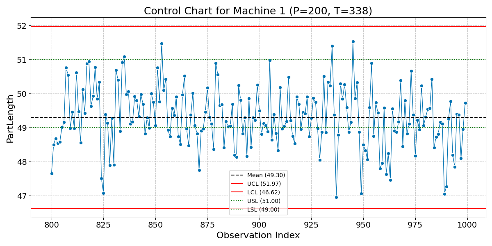
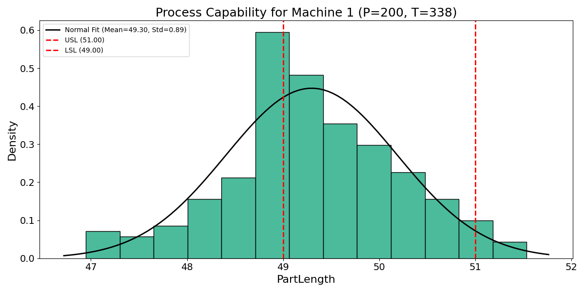
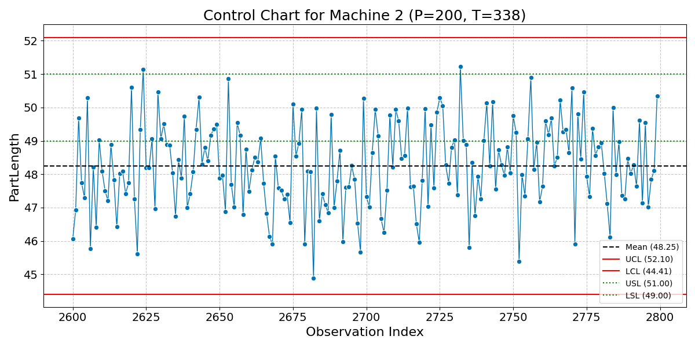
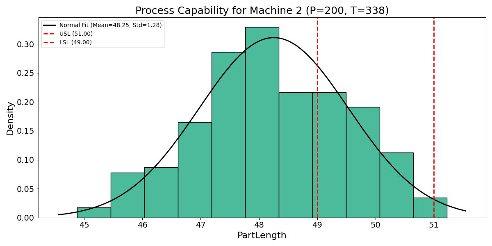
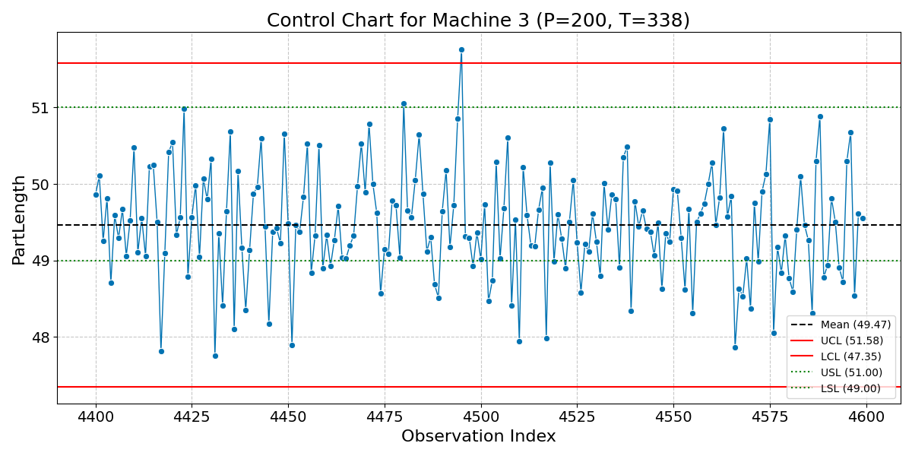
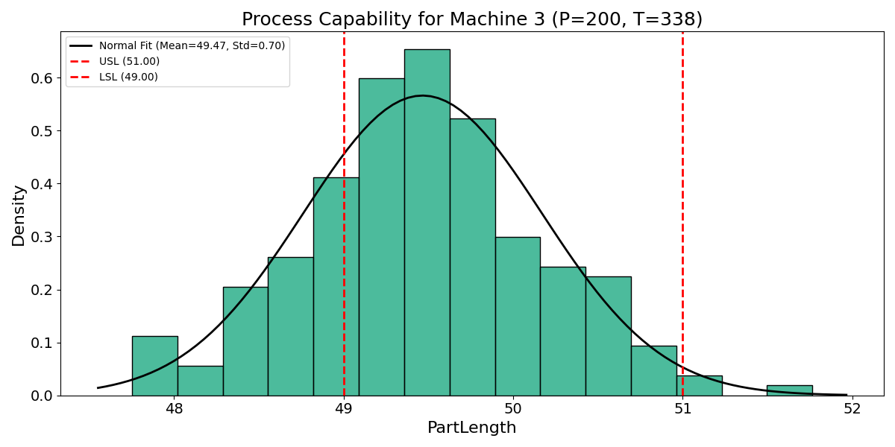
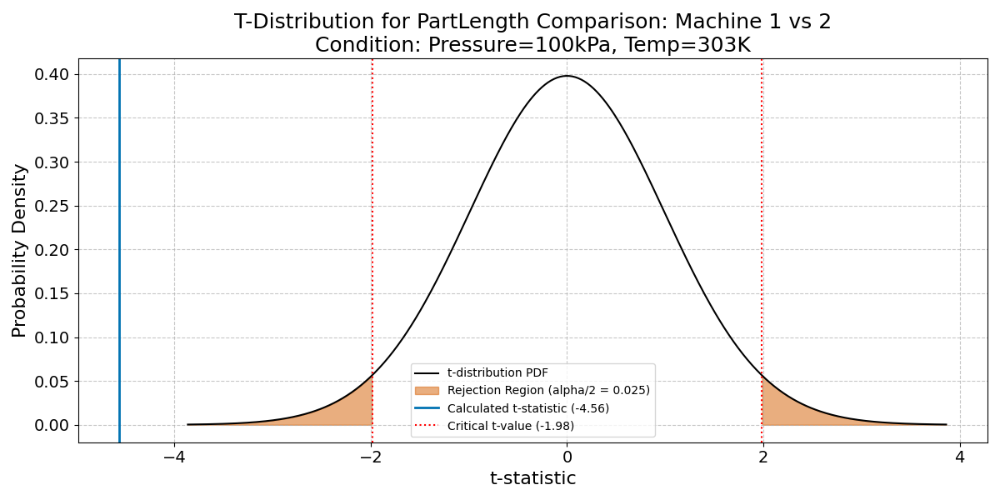
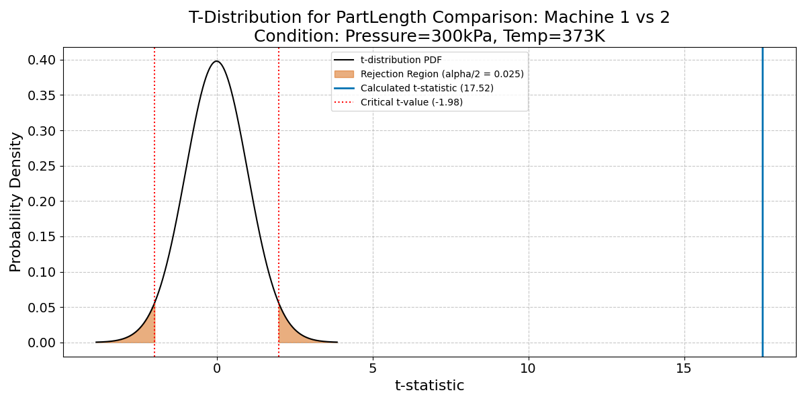
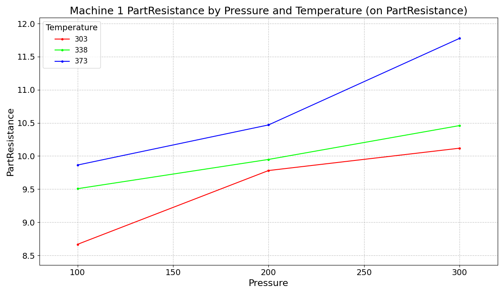

:::: {.columns}
::: {.column width="50%"}

## Sample slides
#### PlaceHolderName
#### Universiti Malaysia Perlis
#### [placeholder@email.com](mailto:placeholder@email.com)

<audio id="bg-music" src="media/audio/sb.m4a" loop></audio>

  Music: “Adrift” by Scott Buckley (CC BY 4.0)

:::

::: {.column width="50%"}

:::

::::

---

:::: {.columns}
::: {.column width="50%"}
### Slide one
**Key Concepts:**
- Energy conservation per @carnot1824.
- $\Delta U = Q - W$
:::

::: {.column width="50%"}

:::
::::

---

---

:::: {.columns}
::: {.column width="50%"}
### The Master Equation
The fundamental relation of thermodynamics:

$$\Delta U = Q - W$$

The work done $W$ is positive when the system expands against an external pressure.
:::

::: {.column width="50%"}
<video data-src="media/videos/sample.mp4" data-autoplay loop muted width="100%"></video>
:::

::::

---

:::: {.columns}
::: {.column width="50%"}
### Visualizing the Gas Law
**Interactive Model:**

- P, V, and T relationships.
- Use the slider to adjust pressure.
- Observe the phase boundary.
:::

::: {.column width="50%"}
<iframe 
  data-src="media/plots/sample.html" 
  width="100%" 
  height="500px" 
  style="border:none;" 
  scrolling="no">
</iframe>
:::
::::

---

:::: {.columns}
::: {.column width="50%"}
### Control Chart: Machine 1
*   **Conditions:** Pressure = 200kPa, Temp = 338K
*   **Measurement:** PartLength
:::

::: {.column width="50%"}

:::

::::

---

:::: {.columns}
::: {.column width="50%"}
### Process Capability: Machine 1
*   **Conditions:** Pressure = 200kPa, Temp = 338K
*   **Measurement:** PartLength
*   **USL:** 51.0, **LSL:** 49.0
:::

::: {.column width="50%"}

:::

::::

---

### Cpk Calculation: Machine 1
*   **Conditions:** Pressure = 200kPa, Temp = 338K
*   **Cpk Value:** `0.11`

$$	ext{Cpk} = \min\left(rac{	ext{USL} - 	ext{Mean}}{3 \cdot 	ext{StdDev}}, rac{	ext{Mean} - 	ext{LSL}}{3 \cdot 	ext{StdDev}}
ight)$$

---

### Capability Assessment: Machine 1
*   **Conditions:** Pressure = 200kPa, Temp = 338K
*   **Cpk:** `0.11`
*   **Conclusion:** `Not Capable (Cpk = 0.11 < 1.33)`

A process is generally considered capable if Cpk $\ge 1.33$.

---

:::: {.columns}
::: {.column width="50%"}
### Control Chart: Machine 2
*   **Conditions:** Pressure = 200kPa, Temp = 338K
*   **Measurement:** PartLength
:::

::: {.column width="50%"}

:::

::::

---

:::: {.columns}
::: {.column width="50%"}
### Process Capability: Machine 2
*   **Conditions:** Pressure = 200kPa, Temp = 338K
*   **Measurement:** PartLength
*   **USL:** 51.0, **LSL:** 49.0
:::

::: {.column width="50%"}

:::

::::

---

### Cpk Calculation: Machine 2
*   **Conditions:** Pressure = 200kPa, Temp = 338K
*   **Cpk Value:** `-0.19`

$$	ext{Cpk} = \min\left(rac{	ext{USL} - 	ext{Mean}}{3 \cdot 	ext{StdDev}}, rac{	ext{Mean} - 	ext{LSL}}{3 \cdot 	ext{StdDev}}
ight)$$

---

### Capability Assessment: Machine 2
*   **Conditions:** Pressure = 200kPa, Temp = 338K
*   **Cpk:** `-0.19`
*   **Conclusion:** `Not Capable (Cpk = -0.19 < 1.33)`

A process is generally considered capable if Cpk $\ge 1.33$.

---

:::: {.columns}
::: {.column width="50%"}
### Control Chart: Machine 3
*   **Conditions:** Pressure = 200kPa, Temp = 338K
*   **Measurement:** PartLength
:::

::: {.column width="50%"}

:::

::::

---

:::: {.columns}
::: {.column width="50%"}
### Process Capability: Machine 3
*   **Conditions:** Pressure = 200kPa, Temp = 338K
*   **Measurement:** PartLength
*   **USL:** 51.0, **LSL:** 49.0
:::

::: {.column width="50%"}

:::

::::

---

### Cpk Calculation: Machine 3
*   **Conditions:** Pressure = 200kPa, Temp = 338K
*   **Cpk Value:** `0.22`

$$	ext{Cpk} = \min\left(rac{	ext{USL} - 	ext{Mean}}{3 \cdot 	ext{StdDev}}, rac{	ext{Mean} - 	ext{LSL}}{3 \cdot 	ext{StdDev}}
ight)$$

---

### Capability Assessment: Machine 3
*   **Conditions:** Pressure = 200kPa, Temp = 338K
*   **Cpk:** `0.22`
*   **Conclusion:** `Not Capable (Cpk = 0.22 < 1.33)`

A process is generally considered capable if Cpk $\ge 1.33$.

---

:::: {.columns}
::: {.column width="50%"}
### T-Test Distribution Curve
*   **Comparison:** Machine 1 vs. Machine 2
*   **Condition:** Pressure=100kPa, Temp=303K
*   **Measurement:** PartLength
*   **Significance Level ($lpha$):** 0.05
:::

::: {.column width="50%"}

:::

::::

---

### T-Test Results
*   **Comparison:** Machine 1 vs. Machine 2
*   **Condition:** Pressure=100kPa, Temp=303K
*   **Calculated t-statistic:** `-4.733`
*   **P-value:** `0.000`

---

### True Difference Assessment
*   **Comparison:** Machine 1 vs. Machine 2
*   **Condition:** Pressure=100kPa, Temp=303K
*   **P-value:** `0.000`
*   **Significance Level ($lpha$):** 0.05
*   **Conclusion (Is there a true difference?):** `Yes`

*A 'Yes' conclusion indicates statistical evidence to reject the null hypothesis that the means are equal.*

---

:::: {.columns}
::: {.column width="50%"}
### T-Test Distribution Curve
*   **Comparison:** Machine 1 vs. Machine 2
*   **Condition:** Pressure=300kPa, Temp=373K
*   **Measurement:** PartLength
*   **Significance Level ($lpha$):** 0.05
:::

::: {.column width="50%"}

:::

::::

---

### T-Test Results
*   **Comparison:** Machine 1 vs. Machine 2
*   **Condition:** Pressure=300kPa, Temp=373K
*   **Calculated t-statistic:** `19.047`
*   **P-value:** `0.000`

---

### True Difference Assessment
*   **Comparison:** Machine 1 vs. Machine 2
*   **Condition:** Pressure=300kPa, Temp=373K
*   **P-value:** `0.000`
*   **Significance Level ($lpha$):** 0.05
*   **Conclusion (Is there a true difference?):** `Yes`

*A 'Yes' conclusion indicates statistical evidence to reject the null hypothesis that the means are equal.*

---

:::: {.columns}
::: {.column width="50%"}
### T-Test Distribution Curve
*   **Comparison:** Machine 1 vs. Machine 2
*   **Condition:** Pressure=100kPa, Temp=303K
*   **Measurement:** PartLength
*   **Significance Level ($lpha$):** 0.05
:::

::: {.column width="50%"}

:::

::::

---

### T-Test Results
*   **Comparison:** Machine 1 vs. Machine 2
*   **Condition:** Pressure=100kPa, Temp=303K
*   **Calculated t-statistic:** `-2.917`
*   **P-value:** `0.004`

---

### True Difference Assessment
*   **Comparison:** Machine 1 vs. Machine 2
*   **Condition:** Pressure=100kPa, Temp=303K
*   **P-value:** `0.004`
*   **Significance Level ($lpha$):** 0.05
*   **Conclusion (Is there a true difference?):** `Yes`

*A 'Yes' conclusion indicates statistical evidence to reject the null hypothesis that the means are equal.*

---

:::: {.columns}
::: {.column width="50%"}
### T-Test Distribution Curve
*   **Comparison:** Machine 1 vs. Machine 2
*   **Condition:** Pressure=300kPa, Temp=373K
*   **Measurement:** PartLength
*   **Significance Level ($lpha$):** 0.05
:::

::: {.column width="50%"}

:::

::::

---

### T-Test Results
*   **Comparison:** Machine 1 vs. Machine 2
*   **Condition:** Pressure=300kPa, Temp=373K
*   **Calculated t-statistic:** `18.962`
*   **P-value:** `0.000`

---

### True Difference Assessment
*   **Comparison:** Machine 1 vs. Machine 2
*   **Condition:** Pressure=300kPa, Temp=373K
*   **P-value:** `0.000`
*   **Significance Level ($lpha$):** 0.05
*   **Conclusion (Is there a true difference?):** `Yes`

*A 'Yes' conclusion indicates statistical evidence to reject the null hypothesis that the means are equal.*

---

### ANOVA Table: Pressure Effect
*   **Machine:** 1
*   **Measurement:** PartResistance
*   **Factor:** Pressure (P)
*   **Pr(>F) Value:** `0.000`
*   **Significance Level ($lpha$):** 0.05
*   **Conclusion (Is this factor significant?):** `Yes`

---

### ANOVA Table: Temperature Effect
*   **Machine:** 1
*   **Measurement:** PartResistance
*   **Factor:** Temperature (T)
*   **Pr(>F) Value:** `0.000`
*   **Significance Level ($lpha$):** 0.05
*   **Conclusion (Is this factor significant?):** `Yes`

---

### ANOVA Table: Pressure*Temperature (P*T) Interaction Effect
*   **Machine:** 1
*   **Measurement:** PartResistance
*   **Factor:** Pressure*Temperature (P*T) Interaction
*   **Pr(>F) Value:** `0.000`
*   **Significance Level ($lpha$):** 0.05
*   **Conclusion (Is this factor significant?):** `Yes`

---

:::: {.columns}
::: {.column width="50%"}
### Interaction Plot
*   **Comparison:** Machine 1
*   **Response Variable:** PartResistance
*   **Factors:** Pressure vs. Temperature
*   **Insight:** Visualizes how the effect of one factor (Pressure) on Resistance changes across levels of another factor (Temperature).
:::

::: {.column width="50%"}

:::

::::

---

:::: {.columns}
::: {.column width="50%"}
### Control Chart: Machine 1
*   **Conditions:** Pressure = 200kPa, Temp = 338K
*   **Measurement:** PartLength
:::

::: {.column width="50%"}

:::

::::

---

:::: {.columns}
::: {.column width="50%"}
### Process Capability: Machine 1
*   **Conditions:** Pressure = 200kPa, Temp = 338K
*   **Measurement:** PartLength
*   **USL:** 51.0, **LSL:** 49.0
:::

::: {.column width="50%"}

:::

::::

---

### Cpk Calculation: Machine 1
*   **Conditions:** Pressure = 200kPa, Temp = 338K
*   **Cpk Value:** `0.11`

$$	ext{Cpk} = \min\left(rac{	ext{USL} - 	ext{Mean}}{3 \cdot 	ext{StdDev}}, rac{	ext{Mean} - 	ext{LSL}}{3 \cdot 	ext{StdDev}}
ight)$$

---

### Capability Assessment: Machine 1
*   **Conditions:** Pressure = 200kPa, Temp = 338K
*   **Cpk:** `0.11`
*   **Conclusion:** `Not Capable (Cpk = 0.11 < 1.33)`

A process is generally considered capable if Cpk $\ge 1.33$.

---

:::: {.columns}
::: {.column width="50%"}
### Control Chart: Machine 2
*   **Conditions:** Pressure = 200kPa, Temp = 338K
*   **Measurement:** PartLength
:::

::: {.column width="50%"}

:::

::::

---

:::: {.columns}
::: {.column width="50%"}
### Process Capability: Machine 2
*   **Conditions:** Pressure = 200kPa, Temp = 338K
*   **Measurement:** PartLength
*   **USL:** 51.0, **LSL:** 49.0
:::

::: {.column width="50%"}

:::

::::

---

### Cpk Calculation: Machine 2
*   **Conditions:** Pressure = 200kPa, Temp = 338K
*   **Cpk Value:** `-0.19`

$$	ext{Cpk} = \min\left(rac{	ext{USL} - 	ext{Mean}}{3 \cdot 	ext{StdDev}}, rac{	ext{Mean} - 	ext{LSL}}{3 \cdot 	ext{StdDev}}
ight)$$

---

### Capability Assessment: Machine 2
*   **Conditions:** Pressure = 200kPa, Temp = 338K
*   **Cpk:** `-0.19`
*   **Conclusion:** `Not Capable (Cpk = -0.19 < 1.33)`

A process is generally considered capable if Cpk $\ge 1.33$.

---

:::: {.columns}
::: {.column width="50%"}
### Control Chart: Machine 3
*   **Conditions:** Pressure = 200kPa, Temp = 338K
*   **Measurement:** PartLength
:::

::: {.column width="50%"}

:::

::::

---

:::: {.columns}
::: {.column width="50%"}
### Process Capability: Machine 3
*   **Conditions:** Pressure = 200kPa, Temp = 338K
*   **Measurement:** PartLength
*   **USL:** 51.0, **LSL:** 49.0
:::

::: {.column width="50%"}

:::

::::

---

### Cpk Calculation: Machine 3
*   **Conditions:** Pressure = 200kPa, Temp = 338K
*   **Cpk Value:** `0.22`

$$	ext{Cpk} = \min\left(rac{	ext{USL} - 	ext{Mean}}{3 \cdot 	ext{StdDev}}, rac{	ext{Mean} - 	ext{LSL}}{3 \cdot 	ext{StdDev}}
ight)$$

---

### Capability Assessment: Machine 3
*   **Conditions:** Pressure = 200kPa, Temp = 338K
*   **Cpk:** `0.22`
*   **Conclusion:** `Not Capable (Cpk = 0.22 < 1.33)`

A process is generally considered capable if Cpk $\ge 1.33$.

---

:::: {.columns}
::: {.column width="50%"}
### T-Test Distribution Curve
*   **Comparison:** Machine 1 vs. Machine 2
*   **Condition:** Pressure=100kPa, Temp=303K
*   **Measurement:** PartLength
*   **Significance Level ($lpha$):** 0.05
:::

::: {.column width="50%"}

:::

::::

---

### T-Test Results
*   **Comparison:** Machine 1 vs. Machine 2
*   **Condition:** Pressure=100kPa, Temp=303K
*   **Calculated t-statistic:** `-4.561`
*   **P-value:** `0.000`

---

### True Difference Assessment
*   **Comparison:** Machine 1 vs. Machine 2
*   **Condition:** Pressure=100kPa, Temp=303K
*   **P-value:** `0.000`
*   **Significance Level ($lpha$):** 0.05
*   **Conclusion (Is there a true difference?):** `Yes`

*A 'Yes' conclusion indicates statistical evidence to reject the null hypothesis that the means are equal.*

---

:::: {.columns}
::: {.column width="50%"}
### T-Test Distribution Curve
*   **Comparison:** Machine 1 vs. Machine 2
*   **Condition:** Pressure=300kPa, Temp=373K
*   **Measurement:** PartLength
*   **Significance Level ($lpha$):** 0.05
:::

::: {.column width="50%"}

:::

::::

---

### T-Test Results
*   **Comparison:** Machine 1 vs. Machine 2
*   **Condition:** Pressure=300kPa, Temp=373K
*   **Calculated t-statistic:** `17.517`
*   **P-value:** `0.000`

---

### True Difference Assessment
*   **Comparison:** Machine 1 vs. Machine 2
*   **Condition:** Pressure=300kPa, Temp=373K
*   **P-value:** `0.000`
*   **Significance Level ($lpha$):** 0.05
*   **Conclusion (Is there a true difference?):** `Yes`

*A 'Yes' conclusion indicates statistical evidence to reject the null hypothesis that the means are equal.*

---

### ANOVA Table: Pressure Effect
*   **Machine:** 1
*   **Measurement:** PartResistance
*   **Factor:** Pressure (P)
*   **Pr(>F) Value:** `0.000`
*   **Significance Level ($lpha$):** 0.05
*   **Conclusion (Is this factor significant?):** `Yes`

---

### ANOVA Table: Temperature Effect
*   **Machine:** 1
*   **Measurement:** PartResistance
*   **Factor:** Temperature (T)
*   **Pr(>F) Value:** `0.000`
*   **Significance Level ($lpha$):** 0.05
*   **Conclusion (Is this factor significant?):** `Yes`

---

### ANOVA Table: Pressure*Temperature (P*T) Interaction Effect
*   **Machine:** 1
*   **Measurement:** PartResistance
*   **Factor:** Pressure*Temperature (P*T) Interaction
*   **Pr(>F) Value:** `0.000`
*   **Significance Level ($lpha$):** 0.05
*   **Conclusion (Is this factor significant?):** `Yes`

---

:::: {.columns}
::: {.column width="50%"}
### Interaction Plot
*   **Comparison:** Machine 1
*   **Response Variable:** PartResistance
*   **Factors:** Pressure vs. Temperature
*   **Insight:** Visualizes how the effect of one factor (Pressure) on Resistance changes across levels of another factor (Temperature).
:::

::: {.column width="50%"}

:::

::::

---

:::: {.columns}
::: {.column width="50%"}
### Control Chart: Machine 1
*   **Conditions:** Pressure = 200kPa, Temp = 338K
*   **Measurement:** PartLength
:::

::: {.column width="50%"}

:::

::::

---

:::: {.columns}
::: {.column width="50%"}
### Process Capability: Machine 1
*   **Conditions:** Pressure = 200kPa, Temp = 338K
*   **Measurement:** PartLength
*   **USL:** 51.0, **LSL:** 49.0
:::

::: {.column width="50%"}

:::

::::

---

### Cpk Calculation: Machine 1
*   **Conditions:** Pressure = 200kPa, Temp = 338K
*   **Cpk Value:** `0.11`

$$	ext{Cpk} = \min\left(rac{	ext{USL} - 	ext{Mean}}{3 \cdot 	ext{StdDev}}, rac{	ext{Mean} - 	ext{LSL}}{3 \cdot 	ext{StdDev}}
ight)$$

---

### Capability Assessment: Machine 1
*   **Conditions:** Pressure = 200kPa, Temp = 338K
*   **Cpk:** `0.11`
*   **Conclusion:** `Not Capable (Cpk = 0.11 < 1.33)`

A process is generally considered capable if Cpk $\ge 1.33$.

---

:::: {.columns}
::: {.column width="50%"}
### Control Chart: Machine 2
*   **Conditions:** Pressure = 200kPa, Temp = 338K
*   **Measurement:** PartLength
:::

::: {.column width="50%"}

:::

::::

---

:::: {.columns}
::: {.column width="50%"}
### Process Capability: Machine 2
*   **Conditions:** Pressure = 200kPa, Temp = 338K
*   **Measurement:** PartLength
*   **USL:** 51.0, **LSL:** 49.0
:::

::: {.column width="50%"}

:::

::::

---

### Cpk Calculation: Machine 2
*   **Conditions:** Pressure = 200kPa, Temp = 338K
*   **Cpk Value:** `-0.19`

$$	ext{Cpk} = \min\left(rac{	ext{USL} - 	ext{Mean}}{3 \cdot 	ext{StdDev}}, rac{	ext{Mean} - 	ext{LSL}}{3 \cdot 	ext{StdDev}}
ight)$$

---

### Capability Assessment: Machine 2
*   **Conditions:** Pressure = 200kPa, Temp = 338K
*   **Cpk:** `-0.19`
*   **Conclusion:** `Not Capable (Cpk = -0.19 < 1.33)`

A process is generally considered capable if Cpk $\ge 1.33$.

---

:::: {.columns}
::: {.column width="50%"}
### Control Chart: Machine 3
*   **Conditions:** Pressure = 200kPa, Temp = 338K
*   **Measurement:** PartLength
:::

::: {.column width="50%"}

:::

::::

---

:::: {.columns}
::: {.column width="50%"}
### Process Capability: Machine 3
*   **Conditions:** Pressure = 200kPa, Temp = 338K
*   **Measurement:** PartLength
*   **USL:** 51.0, **LSL:** 49.0
:::

::: {.column width="50%"}

:::

::::

---

### Cpk Calculation: Machine 3
*   **Conditions:** Pressure = 200kPa, Temp = 338K
*   **Cpk Value:** `0.22`

$$	ext{Cpk} = \min\left(rac{	ext{USL} - 	ext{Mean}}{3 \cdot 	ext{StdDev}}, rac{	ext{Mean} - 	ext{LSL}}{3 \cdot 	ext{StdDev}}
ight)$$

---

### Capability Assessment: Machine 3
*   **Conditions:** Pressure = 200kPa, Temp = 338K
*   **Cpk:** `0.22`
*   **Conclusion:** `Not Capable (Cpk = 0.22 < 1.33)`

A process is generally considered capable if Cpk $\ge 1.33$.

---
# Bibliography

